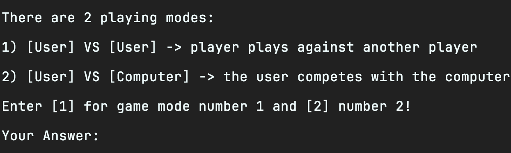

# Rock_Paper_Scissors CSharp
This is a rock paper scissors game you play it in the terminal with c#.

## What does it do?

Basically the program runs in the terminal and asks the user for inputs to play the game.
It stores important data in text files.

[.NET](https://dotnet.microsoft.com/en-us/) is a reliable platform for many application types, I used it because it has many nice tools to use.
For my app I took advantage of the new programming style of console applications and the [IO](https://learn.microsoft.com/en-us/dotnet/standard/io/) library for interacting with files.

I didn't use any further technologies.

I came up with an idea of displaying the Rock Paper Scissors images, that was quite challenging because I had think of an own coordinate system to show the symbols, check out the game for more insight!

## Installation 
Here is the guide to install and play the Rock Paper Scissors game
For the app you need this requirements:

- ... you need to install .NET (at least version 4.7 or higher) 
- ... a processor with minimum 1 GHz
- ... RAM minimum 512 MB 
- ... Disk space minimum 4,5 GB

To download .NET click [here](https://dotnet.microsoft.com/en-us/download)!

### Clone Repository 
Before you start, install [git](https://git-scm.com/downloads) if you haven't already!


Head to the directory, where you want to place the repository, and open a terminal in that folder.
Then enter the following command:

```
   git clone https://github.com/M4tt1-Coder/Rock_Paper_Scissors_CSharp.git 
```

This will clone a the repository to your local repository.
You find the SSH url in the repository it self!

### First Start
Best is, you open it in an IDE like Visual Studio or JetBrains Rider where you can start it manually with a button!
If you want to use it, you can download [Visual Studios](https://visualstudio.microsoft.com/vs/community/) or [JetBrains Rider](https://www.jetbrains.com/rider/download/#section=mac) here!

Another possibility is to start it in the terminal. 

Depending on where you want to run it you could ...

- do it from repository it self. When you are in the project folder enter this command in a local command line:
```
    dotnet Rock_Paper_Scissors_CSharp.dll
```
- start from everywhere. You need to know the path to the repo from where you want to run it and enter this in the terminal: 
```
    dotnet run --project path/to/Rock_Paper_Scissors_CSharp.sln
```

### So what can you expect?
Now after you should be able to start the program there should appear a screen like this:
<br>


For more impressions keep playing!:wink:

## Finally, how do I use it?

It's not that difficult, you just need to know the **"Rock-Paper-Scissors"** rules.
For instructions you can go [here](https://www.wikihow.com/Play-Rock,-Paper,-Scissors)!

You will need to answer with simple inputs of numbers or short words. Of course you can find other control opportunities!

Actually there's not much to say about 'how the game works' ... so just start it and discover it for yourself!

## Credits 

I worked alone on the project so I can't really give specific credits to somebody.

My personal socials:
- [LinkedIn](https://www.linkedin.com/in/matthis-gei%C3%9Fler-4198b9258?utm_source=share&utm_campaign=share_via&utm_content=profile&utm_medium=android_app)
- [Fiverr](https://www.fiverr.com/matthisgeissler)
- [Instagram](https://instagram.com/_m4tt1.g31ssler_?igshid=ZTE5YWJnN29mMnA0)

For the game itself I got some ideas from @anthdm with his YouTube [video](https://www.youtube.com/watch?v=AgPRCBudmGM). 

## License

MIT License

Copyright (c) 2023 Matti

Permission is hereby granted, free of charge, to any person obtaining a copy
of this software and associated documentation files (the "Software"), to deal
in the Software without restriction, including without limitation the rights
to use, copy, modify, merge, publish, distribute, sublicense, and/or sell
copies of the Software, and to permit persons to whom the Software is
furnished to do so, subject to the following conditions:

The above copyright notice and this permission notice shall be included in all
copies or substantial portions of the Software.

THE SOFTWARE IS PROVIDED "AS IS", WITHOUT WARRANTY OF ANY KIND, EXPRESS OR
IMPLIED, INCLUDING BUT NOT LIMITED TO THE WARRANTIES OF MERCHANTABILITY,
FITNESS FOR A PARTICULAR PURPOSE AND NONINFRINGEMENT. IN NO EVENT SHALL THE
AUTHORS OR COPYRIGHT HOLDERS BE LIABLE FOR ANY CLAIM, DAMAGES OR OTHER
LIABILITY, WHETHER IN AN ACTION OF CONTRACT, TORT OR OTHERWISE, ARISING FROM,
OUT OF OR IN CONNECTION WITH THE SOFTWARE OR THE USE OR OTHER DEALINGS IN THE
SOFTWARE.
